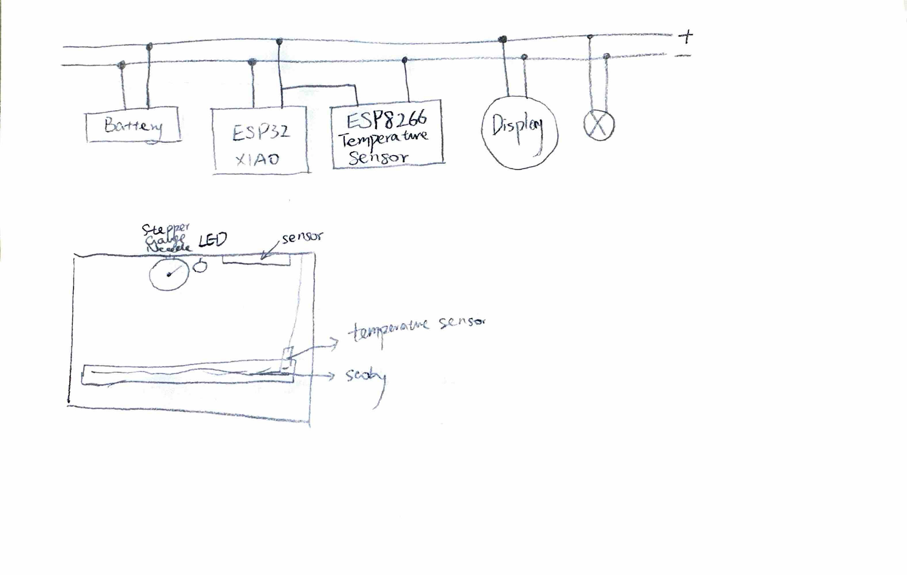

# System Architecture with Diagram HW SW
---
## Real-Time Monitoring of SCOBY growth for Sustainable Biomaterial Development
#### Project Discription:
A standalone device that monitors the fermentation environment conditions of SCOBY to better optimize bacterial cellulose production. The sensor will measure the container bottom or the liquid temperature, pH, and liquid level, with a built-in display for real-time alters and visualized data to prevent mold growth.

#### General Sketch:

#### Sensor Device:
It uses the BMP280/ESP8266 sensor to measure the temperature inside the fermentation setup, ensuring it stays within the optimal range (20–30°C) for SCOBY health. Sensors are connected to an ESP32 XIAO microcontroller. An LED indicator on the device provides a quick visual alert if any parameter goes out of range.

#### Display Device:
The display device will have a stepper-motor-driven gauage needle that provides real-time, such as the temperature. LED will provide visual feedback if the temperature is too high or too low. The PCB device communicates wirelessly with the sensor device.

#### Devices communicate with each other and a detailed diagram 

Link to the datasheet: https://github.com/urnotvicky-li/System-Architecture-with-Diagram-HW-SW-/blob/main/datasheets/0a-esp8266ex_datasheet_en.pdf
